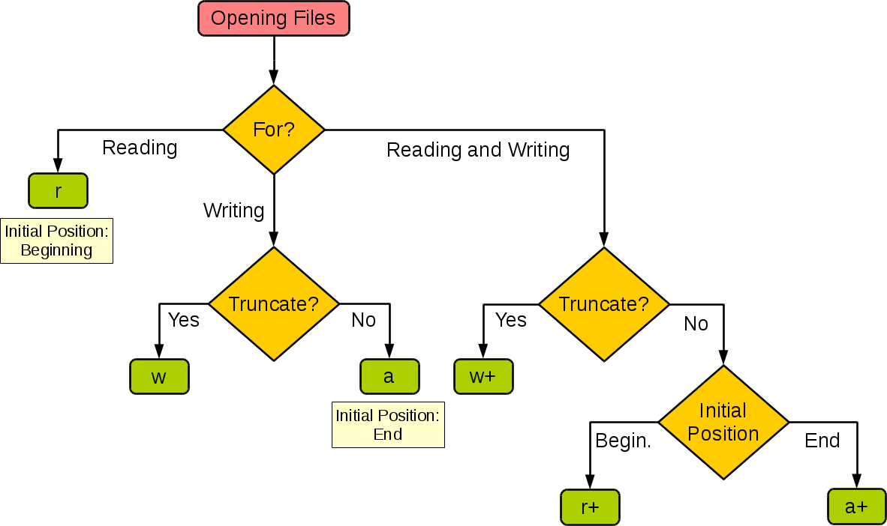

# Re0: 从零开始的 Python 世界探索

> 简单记录下为了机器学习而准备的 Python 全部的过程

## 语言基础

### args/kwargs
```python

def foo(dic, *args, keyword=True, **kwargs):
    print(dic)
    print(args)
    print(keyword)
    print(kwargs)

```


### 遍历词典 Dict

#### 遍历 Key

```python
for key in dict:
```

#### 遍历 Value

```python
for value in dict.values():
```

#### 遍历 KV

```python
for kv in dict.items():
```

#### 遍历 Key-Value

```python
for key, value in dict.items():
```


## 参数


### open




