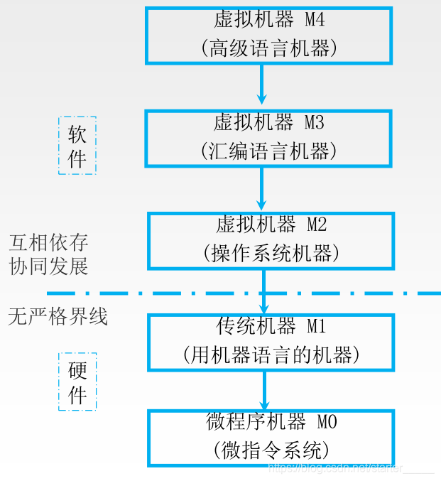

# 计算机组成原理

- P16 1.2.5 计算机性能指标
  - 字长
  - ROM RAM容量
- P18 P19 组成 硬件的的主机部分
  - CPU：运算器 控制器
  - 内存储器：ROM RAM 等
  - 硬件系统
  - Von-Neumann 体系
  - 二进制
- P20
  - (4) 输入设备
  - (5) 输出设备
- P24
  - 
  - 进制转换
- P71 机器数
  - 整数 小数 原码 补码 反码 移码
  - 表示范围
  - 为什么提出？每一种有什么方便的好处？
  - P80 例子 3.8
- P81 浮点数
  - 格式化
  - 规格化122222
  - P85 表示范围
- P106 溢出判断
  - 单符号
  - 进位
  - **双符号**
- P108 加法器实现 
  - 并行加法器
- P112 BCD码 加法
  - 调整
- P138 浮点数运算 `16或2进制`
  - 0 操作数检查
  - 对阶
  - 尾数相加减
  - 结果规格化
  - 舍入
  - P142 双符号位
- P162-163 存储器结构
  - Static : cache
  - Dynamic : Memory
- P168 169  刷新的几种方式
- P179 主存储器与CPU的连接
- P181 存储容量扩展
  - 位扩展
  - 字扩展
  - 字位扩展
- P183 画图
- P195 cache 原理
  - 局部性原理
- P196 cache 工作原理
- P197 地址映射方式
- P200 替换算法
  - RAND
  - FIFO
  - LRU
- P201 写策略
  - 写贯穿
  - 写回策略
- P232 MIPS 指令格式
  - 地址码扩展
- P236 寻址方式
- P245 CISC RISC 特点 比较
- P250  MIPS32 - RIJ 指令 
- P251 - P253 全部指令
- P265 控制器的概述 **看一下**
- P280 MIPS单周期 CPU 的数据通路和指令的执行过程
  - 分析指令格式 每种格式的指令功能
  - 罗列所需器件和器件之间的连接方式
  - 确定每个器件所需的控制信号
- P282 - 291

 
