# 软件工程

## 大纲

- 总体书上的大纲为隔壁张万军的重点，细节补充为葛瀛龙复习课讲的

### 第一章 软件工程概述

- 什么是软件

> IEEE定义对软件的定义如下：
> 软件是计算机程序、规程以及可能的相关文档和运行计算机系统需要的数据。
> 软件包含计算机程序、规程、文档和软件系统运行所必需的数据四个部分。

- 软件有什么特点

> 软件具有复杂性、一致性、可变性和不可见性等固有的内在特性，是造成软件开发困难的根本原因。

> - 软件不能独立存在，需要依附于一定的环境（如硬件、网络以及其他软件）。
> - 软件必须遵从人为的惯例并适应已有的技术和系统。
> - 软件需要随接口不同而改变，随时间推移而变化，而这些变化是不同人设计的结果。

> - 软件是开发产生的，而不是用传统方法制造出来的
> - 软件不会像硬件一样有磨损；软件只会过时，不会磨损。
> - 很多软件不能通过已有构件组装，只能自己定义开发

- 什么是软件工程

> 研究和应用如何以系统性的、规范化的、可定量的过程化方法去开发和维护软件；如何把经过时间考验而证明正确的管理技术和当前能够得到的最好的技术方法结合起来。涵盖了软件生命周期的各个方面，从初始的构想到运行和维护。

- 软件工程和普通的民用的（如建筑工程）有什么区别

- 传统软件工程

  - 瀑布模型

  - 生命周期有几个阶段

  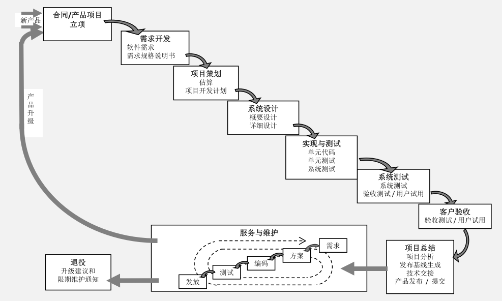

- 传统的软件工程与敏捷开发的差异

- 什么是CMMI，CMMI的全称是什么

> CMMI（Capability Maturity Model Integration）是一套包括多个学科、可扩充的模型系列，其前身主要包括4个成熟度模型（称CMMI的源模型），它们分别是：面向软件开发的SW-CMM、面向系统工程的SE-CMM、面向产品集成的IPD-CMM以及涉及外购协作的SS-CMM；2000年推出第一版，现用的是2018年的2.0版本。

- CMMI五个成熟度的等级

> CMMI共有5个级别，代表软件团队能力成熟度的5个等级，数字越大，成熟度越高，高成熟度等级表示有比较强的软件综合开发能力。
>
> - CMMI一级，执行级。在执行级水平上，软件组织对项目的目标与要做的努力很清晰，项目的目标可以实现。但是由于任务的完成带有很大的偶然性，软件组织无法保证在实施同类项目时仍然能够完成任务。项目实施能否成功主要取决于实施人员。
>
> - CMMI二级，管理级。在管理级水平上，所有第一级的要求都已经达到，另外，软件组织在项目实施上能够遵守既定的计划与流程，有资源准备，权责到人，对项目相关的实施人员进行了相应的培训，对整个流程进行监测与控制，并联合上级单位对项目与流程进行审查。二级水平的软件组织对项目有一系列管理程序，避免了软件组织完成任务的随机性，保证了软件组织实施项目的成功率。
>
> - CMMI三级，明确级。在明确级水平上，所有第二级的要求都已经达到，另外，软件组织能够根据自身的特殊情况及自己的标准流程，将这套管理体系与流程予以制度化。这样，软件组织不仅能够在同类项目上成功，也可以在其他项目上成功。科学管理成为软件组织的一种文化，成为软件组织的财富。
>
> - CMMI四级，量化级。在量化管理级水平上，所有第三级的要求都已经达到，另外，软件组织的项目管理实现了数字化。通过数字化技术来实现流程的稳定性，实现管理的精度，降低项目实施在质量上的波动。
>
> - CMMI五级，优化级。在优化级水平上，所有第四级的要求都已经达到，另外，软件组织能够充分利用信息资料，对软件组织在项目实施的过程中可能出现的次品予以预防。能够主动地改善流程，运用新技术，实现流程的优化。

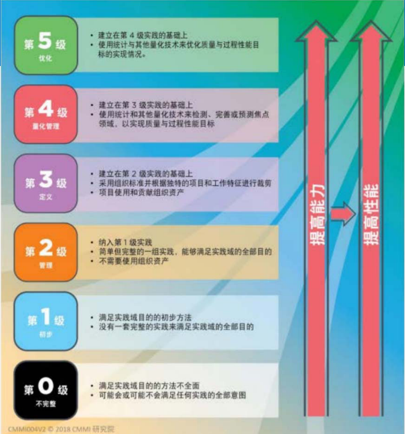

#### 1.2 软件质量管理体系

#### 1.3 软件生命周期及其过程

### 第二章 Scrum及DevOps简介

- 敏捷开发框架

- 图中有多少角色、事件

  - 事件：

    > - Sprint计划会议
    > - 每日Scrum站会
    > - Sprint评审会议
    > - Sprint回顾会议

  - 角色：

    > - 产品负责人（PO），职责是将开发团队开发的产品价值最大化，负责管理产品待办列表，并对其清晰地表达、对其进行排序，确保团队对产品待办列表项有足够深的了解。
    > - 开发团队，负责在每个Sprint结束时交付潜在可发布并且“完成”产品的增量；是自组织的，是跨职能的，每个成员可以有特长和专注的领域。
    > - Scrum Master，对团队而言是一位服务型领导，保证大家能顺利进行冲刺，实现价值的最大化，并与其他Scrum Master一起工作。

- Scrum、Agile、DevOps的区别

> - **敏捷软件开发**（英语：Agile software development），又称**敏捷开发**，是一种从1990年代开始逐渐引起广泛关注的一些新型[软件开发](https://zh.wikipedia.org/wiki/软件开发)方法，是一种应对快速变化的需求的一种软件开发能力。它们的具体名称、理念、过程、术语都不尽相同，相对于“非敏捷”，更强调程序员团队与业务专家之间的紧密协作、面对面的沟通（认为比书面的文档更有效）、频繁交付新的软件版本、紧凑而自我组织型的团队、能够很好地适应需求变化的代码编写和团队组织方法，也更注重软件开发过程中人的作用。
> - **Scrum**是用于开发、交付和维持错综复杂产品(complex products)的敏捷框架(framework)。最初着重于软件开发，之后已被用应用于其他领域，包括研究、销售、营销和其他先进技术领域。一个Scrum团队建议为十名成员的团队而设计的，他们以迭代(iterative)与增量(incremental)式的方式交付工作，每个迭代称作Sprint。一个Sprint的时间不超过一个月，通常是两星期。Scrum团队在每个Sprint都专注在唯一一个共同的目标(Sprint Goal)，每天的Daily Scrum 团队中的开发人员(Developers)都检视朝向这共同目标的进度，和调适当下的计划。在Sprint结束时，团队会进行Sprint审查(Sprint Review)跟利害关系人(Stakeholders)一起检视当下的结果与调适计划，这是互相资讯交流的机会。最后，团队会进行Sprint回顾(Sprint Retrospective)来持续改善。
> - **DevOps**（**Dev**elopment和**Op**erations的组合词）是一种重视“软件开发人员（Dev）”和“IT运维技术人员（Ops）”之间沟通合作的文化、运动或惯例。透过自动化“软件交付”和“架构变更”的流程，来使得构建、测试、发布软件能够更加地快捷、频繁和可靠。
>   - DevOps和敏捷都提供了可以加速软件交付的结构和框架。
>   - 无需在DevOps或敏捷之间进行选择，而是可以同时使用这两种方法：
>     - 通过Scrum或看板进行研发管理，辅以DevOps推动一种更广泛的文化变革，可更快更可靠地交付软件

### 第三章 项目建立及团队组建

- 需要准备哪些材料

> 《立项报告》、《立项可行性分析报告》、BRD（商业需求文档）等

#### 3.3 Scrum角色职责及团队组建

> PO
>
> - 建立产品的愿景，并确保团队理解，即完成产品规划，给出产品路线图；
> - 负责项目的融资和产品的投资回报率（ROI），即该产品是否能立项，客户是否买单，经济可行性如何等是产品负责人的职责。由此，我们的立项报告是由产品负责人主导来起草的，并且阿里等这些大公司里，也是产品经理来负责争取资源的，以确保自己负责的产品得到企业或其他团队的支持。
> - 负责管理Product Backlog（产品积压项或产品待办项）。
> - 和开发团队协作，支持团队完成Sprint目标。
> - 对开发团队的工作结果提供反馈，接受或拒绝工作结果。
> - 决定产品发布日期及内容。

> Scrum Master
>
> - 保证团队资源合理利用；
> - 保证各个角色及职责良好协作；
> - 解决团队开发中的障碍；
> - 作为团队和团队外部的接口，协调解决沟通中的问题；
> - 保证开发过程按计划进行，确保Sprint计划会议，每日站会，Sprint评审，Sprint回顾等活动顺利且正确的得到执行。

- 开发团队包含各种专业人员（比如：设计人员、编码人员、测试人员等），负责在每个Sprint结束时交付潜在可发布并且“完成”的产品增量；

### 第四章 产品策划及积压工作管理

- 积压项整理

> [PPT第44页](./assets/04 产品策划及积压工作管理（任务3）-4学时.pdf)
>
> or教材P103
>
> 太长了不放了

- Scrum层次划分

> DevOps Server的CMMI模型对需求的层级划分，Epic（长篇故事）、Feature（特性）、Requirement（需求）；
> •其中，长篇故事和特性是放在组织积压层级，可以划分到不同的冲刺、团队来完成的；需求只能放在一个团队的某一个冲刺中来完成。
> •Bug可以通过配置，以确定其为冲刺的积压工作项还是任务

> DevOps Server的Scrum模型对需求的层级划分，Epic（长篇故事）、Feature（特性）、Product backlog item（产品积压项）
> •其中，长篇故事和特性是放在组织积压层级，可以划分到不同的冲刺、团队来完成的；PBI只能放在一个团队的某一个冲刺中来完成。
> •Bug可以通过配置，以确定其为冲刺的积压工作项还是任务

> DevOps Server的Agile模型对需求的层级划分，Epic（长篇故事）、Feature（特性）、User Story（用户故事）
> •其中，长篇故事和特性是放在组织积压层级，可以划分到不同的冲刺、团队来完成的；US只能放在一个团队的某一个冲刺中来完成。
> •Bug可以通过配置，以确定其为冲刺的积压工作项还是任务

- PO如何获取需求、获取需求的方法

> 怎么获取
>
> - 技术演示、临时项目评审
> - 问卷调查、访谈、场景
> - 演练、与利益相关放进行质量属性抽取研究会
> - 原型和模型、头脑风暴
> - 市场调查、Beta测试
> - 从文档、标准或规范等来源中提取
> - 观察现在的解决方案、环境和工作流模式
> - 用例、业务案例分析、用户的招标文件
> - 逆向工程
> - 客户满意度调查、观点分析

> 收集用户需求，将用户需求文档化（形式可以多样）；
>
> - 对用户需求进行评审，就用户需求说明书或MRD达成一致；
> - 对需求进行分析，将分配给软件的系统需求文档化，形成需求规格说明书或PRD（产品需求文档）；对分析的定稿的需求进行评审并建立软件需求基线；
> - 管理和控制需求基线及需求变更，保持软件需求和项目计划、工作产品及过程活动的一致性。

> 来源：
>
> - 客户提供的意见；
> - 利益相关方提供的意见；
> - 以前的工作；
> - 现有的解决方案；
> - 领域参考文献；
> - 法律和法规、标准；
> - 业务政策；
> - 以前的架构设计决策和原则；
> - 商业环境需求（如实验、测试和其他设施、信息技术基础设施）；
> - 竞争性产品分析
> - 用户任务的内容分析

> 内容：
>
> - 技术需求：
>   - 外部接口或连接、内部接口或连接（在设计期间开发）；
>   - 功能的质量、操作、性能
>   - 验证、确认、验收准则；
>   - 安全性
> - 非技术性需求：
>   - 价格和成本
>   - 交付的约束条件
>   - 资源的约束条件
>   - 培训、客户互动（例如状态报告、会议）

#### 4.1 需求收集及管理

#### 4.2 需求层次结构及管理

#### 4.3 用收集的需求进行产品策划

### 第五章 冲刺计划及跟踪管理

- 什么是冲刺
- 冲刺订单和积压项有什么关系

> 在项目开始时已知的所有需求都聚集在产品积压（Product Backlog）区中，这是Scrum的核心概念之一。项目团队审查积压项，并选择哪些需求应该包含在第一次迭代(Sprint）中，这些选定的需求被添加到迭代积压（Sprint Backlog）中，称之为一个冲刺。

- 第一次冲刺与第二次冲刺之间是一次迭代，那什么是迭代
- 活动
  - 冲刺计划会议、每日站会、计划和评审、总结与回顾
  - 涉及到的角色（参与者）、每个活动达到什么目的

> 冲刺会议
>
> - 目的：计划当前Sprint要做的工作；
> - 时间点：Sprint的第一天；
> - 时长：2小时*Sprint周数（1-4周）；
> - 与会人员：PO（必须参加）、开发团队（必须）、Scrum Master（可选）——建议参加；
> - 会议议程：
>   - 确定当前Sprint要完成哪些功能（做什么）
>   - 确定如何完成这些功能（怎么做）
> - 会议结果：Sprint目标确立，Sprint Backlog产生，团队承诺完成Sprint目标

- 估算（作为计算题）`必考`
  - 不但对代码进行估算，也对资源进行估算（人、计算机等）
  - 几种估算的方法：
    - Delphi法（专家法）、PERT法（三点估算法）、Scrum法（敏捷估算）

> 敏捷估算
>
> - 每个团队成员拿到一组卡片，包括0,0.5,1,2,3,5,8,13,20,40,100,?,∞,共计13张。
> - 第一步，PO对冲刺中第一个待办事项（需求）进行讲解；并询问大家是否有疑问，直到没有疑问为止。
> - 第二步，团队讨论这个项进行讨论；
> - 第三步，当团队都充分了解这个项之后，每个团队成员按照自己的想法给出估算结果，并选择相应的扑克出牌，估算结果不能告诉其他人，出牌时数字朝下扣在桌子上。
> - 第四步，所有人都给出结果后，大家亮出估算数字。
> - 第五步，如果大家给出的结果不一样，则最大值和最小值的人给出详细的讲解说明，主要是明确：我们是否想法一致？我们是否存在分歧？有没有什么是我没有考虑到的？讨论之后可以再估算一轮，最终团队需要达成一致。
> - 第六步，重复以上步骤，直到本冲刺所有的条目估算完成。估算结果填写到对应的需求“规模”处。

> 三角估算
>
> - 从PBI中挑选一个较小但不是最小的条目，比如条目A，并设定它的估算值为3（故事点）。
> - 从PBI的最上面取出一个条目B，和A进行对比；如果比A大，放在A的右边；如果比A小，放在A的左边；如果和A差不多大小，放在A的下面。
> - 继续从PBI中取出条目C，重复步骤2，分别和条目A条目B进行比较，直到为条目C找到合适的位置。
> - 重复步骤2和3，直到所有的产品列表条目都完成放置
> - 比较A左边的PBI，估算值为2还是1，把左边的所有条目估算值设置为2或1，同样把A右边的条目，按列标明估算值。
> - 最后就可以得到各个PBI条目的相对估算值，出现类似如下图所示的结果：
>
> 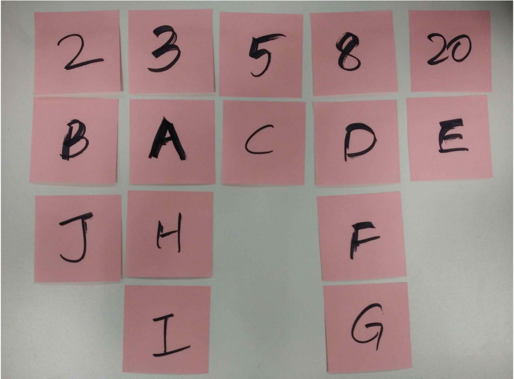

> PERT估算
>
> - 乐观值 O  可能值 M 悲观值 P
>
> $$
> E = \frac{O+4M+P}{6}
> $$

- 敏捷开发团队
  - 特点、与传统比有什么优势
- 燃尽图
  - 特点、作用
  - 什么是容量，如何设置

> **燃尽图**（英语：**burn down chart**）是用于表示剩余工作量的工作图表，由横轴（X）和纵轴（Y）组成，横轴表示时间，纵轴表示工作量。这种图表可以直观的预测何时工作将全部完成，常用于软件开发中的[敏捷软件开发](https://zh.wikipedia.org/wiki/敏捷软件开发)方式，也可以用于其他类型的工作流程监控。
>
> 
>
> - 一般可以在图表中绘制两条线段，一条表示期望的工作进度，另一条记录实际的工作进度，把工作拆分成若干工作要点，完成一个就减去一个，以此来衡量工作距离全部完成的剩余时间。
> - 当实际工作曲线低于期望值时，则表示工作可能提前完成，相反的情况则可能会延期。如果每次绘制的图标，实际进度曲线都在期望值下方，则表示计划做的过于保守，可以适当缩短；相反的情况则表示计划过于激进，应当适当延长。也可以通过多次的记录统计，了解工作团队的工作效率是否有一定的提升，找出提高效率的办法。

### 第六章 配置管理及版本控制

- SCM
  - 什么是SCM（配置管理）

> 软件配置管理（Software Configuration Management）是一种标识、组织和控制修改的技术
>
> - 软件配置管理应用于整个软件工程过程
> - 目标就是为了标识变更、控制变更、确保变更正确实现并向其他有关人员报告变更，使错误降为最小并最有效地提高生产效率

- 版本控制

  - 使用的工具，区别，有哪些
    - 基于中心、基于分部式

  > 采用中央式系统，由中央权威管理访问权限；或是像[分布式系统](https://zh.wikipedia.org/wiki/分散式版本控制系統)容许多个单位同时进行，包括同时更动同一文件。
  >
  > 传统上版本控制系统都是采用中央式系统：所有版本控制的工作在一个服务器进行，由中央权威管理访问权限“锁上”文件库中的文件，一次只让一个开发者工作。

  - 图：过程，角色、库有哪些

UML

- 用例图、活动图
- 给场景画图，没标准答案，但要素不能错

> 活动图
>
> 活动图(Activity Diagram)在UML里，本质上就是流程图，它描述系统的活动，判断点和分支等。活动图除了描述对象状态之外，更突出了它的活动。一个活动结束自动引发下个活动，则两个活动之间用带箭头的连线连接，连线的箭头指向下一个活动。
>
> - 元素
>
>   - 泳道
>
>     - 将模型中的活动按照职责组织起来。这种分配可以通过将活动组织成用线分开的不同区域来表示。由于它们的外观的缘故，这些区域被称作泳道。
>     - 例
>
>     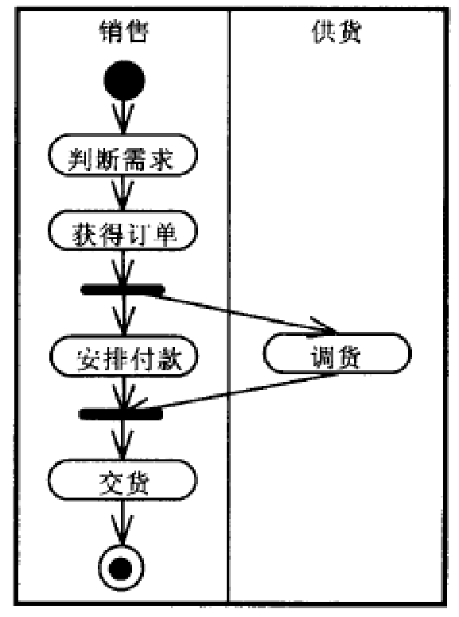
>
>   - 控制流
>
>   - 开始和结束状态
>
>   - 活动状态和状态
>
>   - 转换（分叉）
>
>   - 转换（连接）
>
>   - 判定
>

> 用例图
>
> UML的用例图可以表示客户的需求，通过用例建模可以对外部的角色以及它们所需要的系统功能建模
>
> - 要素
>
>   - 从系统的使用者的角度所理解的系统的总体功能。
>
>   - 建立于系统需求阶段，是开发者和用户对系统需求达成的共识。
>
>     - 用例： 描述一个系统做什么
>     - 参与者：表示用例的使用者在与这些用例交互时所扮演的角色 可以是：人、硬件设备或一个系统
>
>     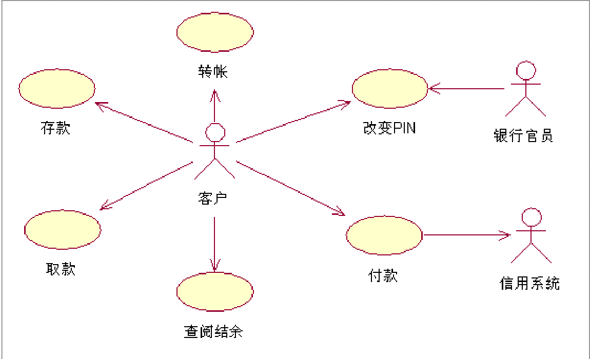
>
>     - 包：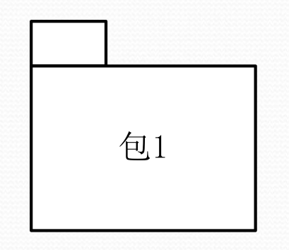包是模型的一部分，模型的每一部分必须属于某个包。建模者可以将模型的内容分配到包中。但是为了使其能够工作，分配必须遵循一些合理的原则，如公用规则、紧密耦合的实现和公用观点等。UML对如何组包并不强制使用什么规则，但是良好的组包会很大地增强模型的可维护性。
>     - 通信：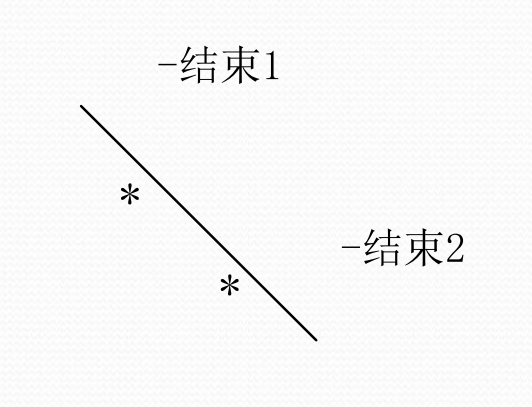不带箭头的线段将执行者与用例连接到一起，表示两者之间交换信息，称之为通信联系。执行者触发用例，并与用例进行信息交换。单个执行者可与多个用例联系；反过来，一个用例可与多个执行者联系。对同一个用例而言，不同执行者有着不同的作用；他们可以从用例中取值，也可以参与到用例中。
>     - 使用（包含）：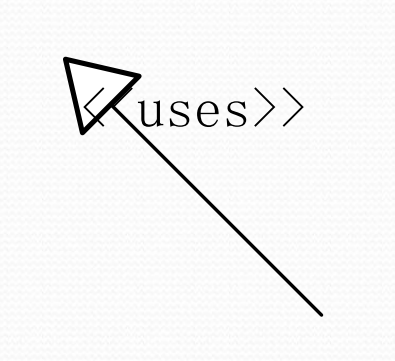一个用例使用另一个用例时，这两个用例之间就构成了使用关系。一般情况下，如果若干个用例的某些行为是相同的，则可以把这些相同的行为提取出来单独作为一个用例，这个用例称作抽象用例。这样当某个用例使用该抽象用例时，就好像这个用例包含了抽象用例的所有行为。
>
>     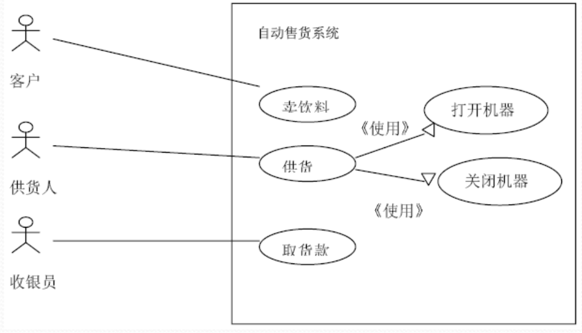
>
>     - 扩展（泛化）：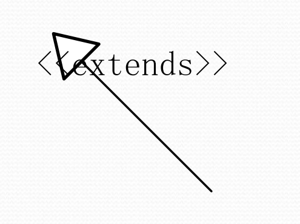一个用例中加入一些新的动作后，则构成另一个用例，这两个用例之间的关联是概括化关系，称作扩展关联。后者通过继承前者的一些行为得来，前者通常称为概括化用例，后者常称作扩展用例。
>
>     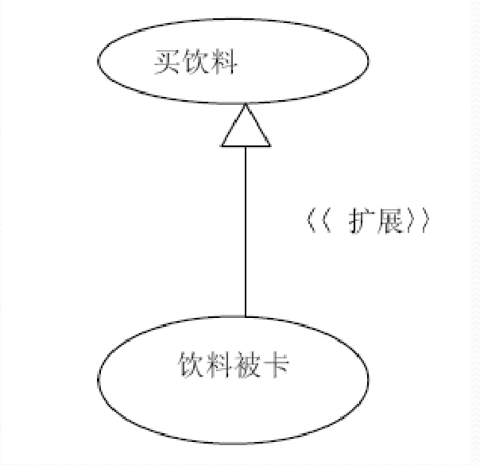
>
>     - 约束：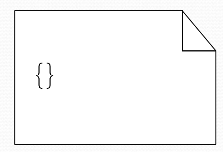在UML中，可以用约束(Constraint)表示规则。约束是放在括号“{}”中的一个表达式，表示一个永真的逻辑陈述。在程序设计语言中，约束可以由断言(Assertion)来实现。

### 第八章 软件测试及持续测试

- 什么是回归测试

> 回归测试过程
>
> 1. 识别出软件中被修改的部分
> 2. 从原[基线](https://zh.wikipedia.org/wiki/基線)测试用例库“T”中，排除所有不再适用的测试用例，确定对新版本依然有效的测试用例，创建新的基线测试用例库“TN”
> 3. 依据一定的策略从TN中选择测试用例测试被修改的软件
> 4. 如果必要，生成新的测试用例集“T1”，用于测试TN无法充分测试的软件部分
> 5. 用T1执行修改后的软件
>
> - 第2和第3步测试验证修改是否破坏了现有的功能，第4和第5步测试验证修改工作本身。
>
> 观念
>
> - 回归测试是指重复执行以前的全部或部分相同的测试工作。
> - 新加入测试的模块，可能对其他模块产生副作用，故须进行不同程度的回归测试。
> - 回归测试的重心，以关键性模块为核心。

- 什么是自动化测试

> **自动化测试**指的是使用独立于待测软件的其他[软件](https://zh.wikipedia.org/wiki/软件)来自动执行测试、比较实际结果与预期并生成测试报告这一过程。自动化测试在测试流程已经确定后，测试自动化可以自动执行的一些重复但必要测试工作。也可以完成手动测试几乎不可能完成的测试。对于[持续交付](https://zh.wikipedia.org/wiki/持續交付)和[持续集成](https://zh.wikipedia.org/wiki/持续集成)的开发方式而言，测试自动化是至关重要的。

- 什么是持续测试

> 持续测试可以看作敏捷测试的进阶版，意味着持续不断的测试，贯穿了整个软件交付周期，包括从需求分析到产品部署的各种测试阶段。
>
> - 持续测试提倡尽早测试、频繁测试和自动化测试。
> - 测试与代码开发同时进行，开发人员和测试人员共同分析测试需求，共同编写和维护测试用例，每开发完一项任务就立即运行自动化测试集对交付质量进行验证，从而形成持续验证。代码一旦成功通过了自动化测试集就会立刻部署到生产环境中，进行生产阶段的持续监控。

- 敏捷开发中的测试和传统测试有什么区别

> 在敏捷测试中，测试不再是一个单独的阶段，它属于迭代计划的一个组成部分，测试人员始终与开发人员保持同步，共同负责产品的质量保障。敏捷提倡频繁且更快地进行测试，因此自动化测试在敏捷测试中至关重要。
>
> - 特点：从开发到运营的整体流程来看，敏捷模型仅仅融合了开发和测试两个部分，加快了软件开发的频率。但是实际部署到生产环境仍然是由运维团队独立完成，开发和运维之间依然隔着厚厚的一堵墙，繁琐的发布周期使敏捷工作重新回到了瀑布模式。

- 有几种方法
- 分类是怎么样的
  - 按阶段、按过程
  - 静态、动态，黑盒、白盒、灰盒

> 按测试特性分类：
>
> - 白盒测试：测试人员直接在软件的源程序上进行测试、修改、复测。要求测试工程师对软件的内部结构及逻辑有深入的了解，并掌握写成该源程序的语言。分为：语句测试；分支测试；路径测试；条件测试；目测。
> - 灰盒测试：介于白、黑两者之间，是两者的结合。测试工程师对软件程序结构有一定了解，但了解的程度又不需要达到白盒测试的深度。
> - 黑盒测试：测试人员不必深入了解软件的内部设计，只是从一个终端用户的角度，根据产品说明书的指标，从外部测试软件的各项功能及性能。黑盒测试主要是功能测试。

> 按开发过程分类：
>
> - 单元测试、集成测试、系统测试、用户验收测试及回归测试。
> - 回归测试一般是在缺陷修改之后执行，保证原缺陷不在重现，并且缺陷的修改不影响其他功能。

> 按测试要求分类：
>
> - 基本功能测试（Smoke test）：只对软件的关键功能做测试，而不必卷入细致的测试，不必面面俱到。
> - 全面测试（Sanity test）：不仅对软件关键功能测试，还要覆盖软件的全部功能，是回归测试的主要组成部分。
> - 基准测试（Benchmark test）：对指定的一个或一组程序及数据在不同的计算机上执行测试，以测定其在标准情况下、特定配置下的工作性能，并将其执行速度、完成需时等加以比较。

> 按软件特性分类：
>
> - 功能测试主要包括。等价区间测试，把输入空间划分几个“等价区间”，在每个区间中只需要测试一个典型值即可；边界值测试；随机测试；状态转换测试；流程测试等。
> - 非功能测试主要包括：安装/卸载测试；使用性测试；恢复测试；兼容性测试；安全测试；性能测试；强度/压力测试；容量测试；任意测试等。

- 依据，基本准测

> 1. 完全测试程序是不可能的，不可能找出软件的所有缺陷，这是因为：可能的操作场景太多，使得输入量太大；软件在开发过程中，同样的功能实现途径太多；软件规格说明书没有客观标准，从不同的角度来看，软件缺陷的标准不同。
>
> 2. 软件测试是有风险的行为，如果决定不去测试所有的情况，那就是选择了风险。软件测试人员要学会的一项基本的技能就是如何把无边无际的可能减少到可以控制的范围，以及如何针对风险制订做出明智抉择，去粗存精。
>
> 3. 测试无法显示潜伏的软件缺陷，可以报告已发现的软件缺陷，却无法报告潜伏的软件缺陷，更不可能保证找到全部的缺陷。
>
> 4. 软件缺陷会成群出现，发现一个附近就会有一群:
>
>    - 程序员怠倦，第一天编写代码还不错，第二天就会烦躁不安了，那么一个软件缺陷很可能会表明附近有更多的软件缺陷；
>
>    - 程序员往往会犯同样的错误，每个程序员都有自己的偏好及编码习惯；
>    - 某些软件缺陷是大灾难的征兆，一开始某些缺陷似乎毫无关联，但其有可能是由一个极其严重的原因造成的。
>
> 5. 杀虫剂怪事，与农药杀虫是一样的，软件对测试方法及技术也有免疫力，只有发明新的杀虫剂（测试技术或方法）去找虫子。
>
> 6. 并非所有软件缺陷都能修复，要权衡成本、进度及市场需要。
>
> 7. 软件测试员在小组中不受欢迎，软件测试员的任务是检查和批评同事的工作，挑毛病，公布发现的问题

- 软件缺陷
  - 什么是软件缺陷
  - 为什么会产生缺陷

> 软件缺陷，即为计算机软件或程序中存在的某种破坏正常运行能力的问题、错误，或者隐藏的功能缺陷。
>
> - 标准的定义：从产品内部看，缺陷是软件产品开发或维护过程中存在的错误、毛病等各种问题；从产品外部看，缺陷是系统所需要实现的某种功能的失效或违背。

> - 软件模型或者说业务建模制定不正确，也就是说，产品规格说明本身不明确或有错误，没有能很好的描述要开发的软件，或者对产品规格的理解有误，这类原因占了60%以上，并且很难于纠正。
> - 代码编写错误，此类原因导致的缺陷大概占20%左右，这类缺陷比较容易纠正，通过调试找到出错的代码就可以完成修复。
> - 软件变更会引入新的缺陷，而不只是变更部分产生缺陷；也就是说，个别功能的修改会影响到其他部分。
> - 软件庞大，功能十分复杂；或者与软件对接的第三方软件本身存在问题，这些也都会导致缺陷的产生。

时间

- 一次冲刺多久

> - Sprint的长度不超过1个月，要有明确的待完成需求（目标），还需要一份设计过和灵活的计划用来指导如何做这些事情、工作内容和最终产品增量。
> - Sprint时间太长的话，对要构建什么的定义就有可能会改变，复杂性也有可能会增加，同时风险也有可能会增加。
> - Sprint通过确保至少每月一次对达成目标的进度进行检视和适应，来实现可预测性。
> - Sprint同时也把风险限制在一个月的成本上；并且船小好掉头，以灵活的应对各种变法和风险。

- 站会多久

> 约15min

速度

- 什么是开发速度
- 速度有什么作用

#### 8.1 软件测试简介

## 题型

- 常识性问题（概念）
- git命令（实践性内容）
- 计算题

> 填空
>
> 简答
>
> - eg：版本控制中，中心、分部式两种有什么区别？
>
> 论述
>
> - 讨论某一个方案，说出选择原因
>
> 应用题
>
> - 画活动图、用例图
> - 估算工作量、优先级

