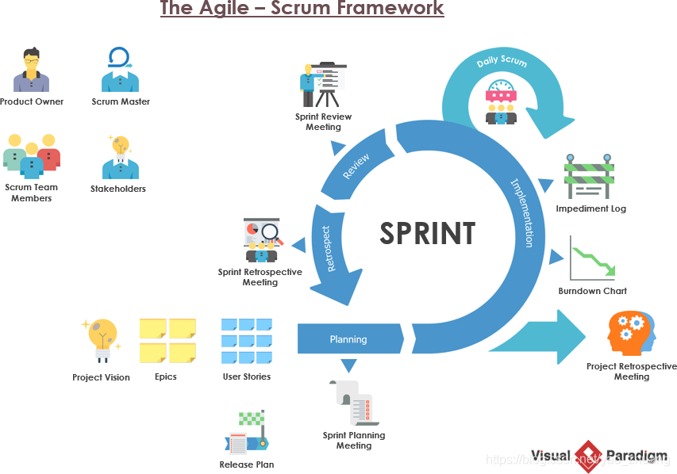

# 软件工程 复习要点

## 软件工程概念

### 软件的特点

> 其具有复杂性、一致性、可变性和不可见性等固有的内在特性。

软件作为产品的生产流程及其相应的管理活动，远远没有一个成熟的模式。

- 只能开发 - 开发出来的，而不是用传统方法制造出来的
- 无磨损 - 只会过时，不会磨损
- 不能组装 - 不能通过已有的构件组装，只能自己定义开发


### 传统软件工程

“软件交付危机”

> 市场对定制化软件开发的需求越来越大，采用瀑布模型的软件项目管理遇到了前所未有的挑战。
>
> 表现为软件交付严重滞后。


### 现代软件工程

敏捷开发模式、Scrum敏捷开发


#### 阶段与特点

- 透明

  > 过程中的关键环节对于那些产出负责的人必须是显而易见的

- 检视

  > 经常检视Scrum的项目和完成目标的进度

- 适应

  > 如果检视者发现过程中的一个或多个方面偏离可接收范围以外，必须对过程加以调整。


## Scrum

构架图




### Scrum 角色

#### 产品负责人 Product Owner

**做正确的事**

- 一个人
- 产品的最终负责人
- 精通业务
- 果断，有决定权
- 回答需求方面的问题


- 确保团队理解，完成产品规划，给出产品路线图
- 融资和产品的投资回报率
- 负责管理积压项
- 和开发团队协作
- 对开发团队提供协作，完成反馈
- 决定发布日期和时间


#### Scrum Master

**正确的做事**

- 协调、激励整个团队工作开展
- 服务型领导
- 具有影响力
- 确保团队按照 Scrum 方式运行


- 保证团队资源合理利用
- 保证各个角色职责良好协作
- 解决团队中的开发障碍
- 协调解决沟通问题
- 保证开发过程按计划进行


#### 开发团队

**高效的做事**

- 小型团队
- 自组织
- 平等
- 跨职能
- 原子性


阶段 活动
参加的人 持续时间

### 积压项

积压项 层次

为什么梳理


冲刺的积压项与产品积压项有什么区别

积压项估算的方法 过程
估算内容

### 对比

每个角色在各个工作过程中 谁参加 谁做了什么
与之前传统的开发团队对比 有什么特点

## CMMI

> Capability Maturity Model Integration 软件能力成熟度模型集成

五个级别


1. 初试级
2. 受管理级
3. 已定义级
4. 定量管理级
5. 持续优化级


## DevOps


## Agile


## 立项

立项阶段内容 提交什么 需要做什么


1. 谁提出项目立项

   > 《业务立项申请单》
   >
   > 

2. 怎样提出项目立项

   > 《立项可行性分析报告》
   >
   > 《商业需求文档》

3. 谁进行立项评审

   > 

4. 怎么进行评审

   > 《合同评审办法》

5. 谁签发

   > 《项目任务书》


## 需求

需求阶段

### 怎么获取获取需求

- 技术演示、临时项目评审
- 问卷调查、访谈、场景
- 演练、与利益相关放进行质量属性抽取研究会
- 原型和模型、头脑风暴
- 市场调查、Beta 测试
- 从文档、标准或规范等来源中提取
- 观察现在的解决方案、环境和工作流模式
- 用例、业务案例分析、用户的招标文件
- 逆向工程
- 客户满意度调查、观点分析


### 敏捷开发需求分析的层次

- 长篇故事：模块
- 特性
- 积压项：详细功能


## 冲刺


### 估算方法


- Delphi 专家估算方法

- PERT 乐观值 O  可能值 M 悲观值 P
  $$
  E = \frac{O+4M+P}{6}
  $$

- 参照历史数据

  - 代码行 用例点 功能点 故事点


Scrum 估算

估算大小即规模，非时间。使用一组类似Fibonacci


### 站立会议

每 24 小时一次，一次 15 分钟。

- 昨天做了什么
- 今天要做什么
- 遇到了什么问题

对整体的目标表示关心，善于发现团队的问题。


#### 燃尽图

随着迭代的进行而减少的工作量，图形化的形式显示。

尽量使用故事点（规模）表示。

**燃耗：增加了更多的积压项**


速度图：有助于说明团队实现积压项的故事点、规模、工作量能力。

累计流图：显示了所有的冲刺从定义的时间到当前的进度。还指示进行重点而工作以及完成工作项目的速度和将项目添加到团队项目的速度图标。


### 容量

- 明确一个冲刺多长时间，建议按 2 周确定
- 计算一个冲刺有多少工作日，5 or 6
- 每个团队成员在冲刺时期可工作多少时间，除去休息日和参加的会议等


## UML

###  活动图

它描述系统的活动，判断点和分支等。活动图除了描述对象状态之外，更突出了它的活动。一个活动结束自动引发下个活动，则两个活动之间用带箭头的连线连接，连线的箭头指向下一个活动。  


> 1. 泳道。将模型中的活动按照职责组织起来。这种分配可以通过将活动组织成用线分开的不同区域来表示。由于它们的外观的缘故，这些区域被称作泳道。
> 2. 控制流。表示活动之间的转换，各种活动之间的流动次序。表示两个状态或动作状态之间的关系，并指明第一个状态中的对象将进入第二个状态并执行指定的动作。
> 3. 开始和结束状态。实心圆表示活动图的起点，实际上是一个占位符，带边框的实心圆表示终点。
> 4. 活动状态和状态。圆角矩形表示执行的过程或活动。
> 5. 转换（分叉）。一个分叉具有一个输入转换和若干个输出转换。当分叉的输入转换被触发时，其所有输出转换都将并行发生。
> 6. 转换（连接）。连接用来描述若干个并行进程同步。对一个连接而言，仅当其所有输入转换上的状态都完成了相应的活动时，输出转换才会发生。
> 7. 判定。菱形表示判定点 。


### 用例图

通过用例建模可以对外部的角色以及它们所需要的系统功能建模。从系统的使用者的角度所理解的系统的总体功能。建立于系统需求阶段，是开发者和用户对系统需求达成的共识。


> 1. 用例。描述一个系统做什么
> 2. 参与者。表示用例的使用者在与这些用例交互时所扮演的角色可以是：人、硬件设备或一个系统
> 3. 通信。不带箭头的线段将执行者与用例连接到一起，表示两者之间交换信息，称之为通信联系。执行者触发用例，并与用例进行信息交换。单个执行者可与多个用例联系；反过来，一个用例可与多个执行者联系。对同一个用例而言，不同执行者有着不同的作用；他们可以从用例中取值，也可以参与到用例中。 
> 4. 使用（包含）。一个用例使用另一个用例时，这两个用例之间就构成了使用关系。一般情况下，如果若干个用例的某些行为是相同的，则可以把这些相同的行为提取出来单独作为一个用例，这个用例称作抽象用例。这样当某个用例使用该抽象用例时，就好像这个用例包含了抽象用例的所有行为。
> 5. 扩展（泛化）。一个用例中加入一些新的动作后则构成另一个用例这两个用例之间的关联是概括化关系称作扩展关联，后者通过继承前者的一些行为得来前者通常称为概括化用例后者常称作扩展用例。


### 顺序图

纵向是时间轴，时间沿竖线向下延伸。横向轴代表了在协作中各独立对象的类元角色。一种动态建模方法 。


> 1. 对象生命线。对象生命线是一条垂直的虚线，表示对象存在的时间 。
> 2. 消息。消息是对象之间的一条水平箭头线，表示对象之间的通信，返回消息显示为虚线 。 
> 3. 激活。激活是一个细长的矩形，表示对象执行一个所经历的时间段。
> 4. 生命线。每个对象向下生出一条虚线被称为生命线，这些线定义了图的时间轴。按常规时间延向下方向流逝，生命线描述了它们所联系的对象将存在多久


## SCM

SCM 角色 图 画出来 讲述怎么工作的

## Git

git 集中式 分布式

Git push 修改 等
创建分支 提交

### 初始化

在目录中创建新的 Git 仓库。

```
git init
```

### 获取项目

```
git clone [URL]
```

拷贝一个 Git 仓库到本地，让自己能够查看该项目，或者进行修改。

举例：

```
git clone git@ssh.dev.azure.com:v3/s-Dante/Dante/Dante
```

### 添加文件

```
git add [fileName1] [fileName2] ...
```

将该文件添加到缓存

举例：添加文件README.md和文件hello.java

```
git add README.md hello.java
```

### 查看状态

```
git status
```

查看在你上次提交之后是否有修改

### 查看变化

```
git diff
```

 来查看执行 git status 的结果的详细信息

- 尚未缓存的改动：**git diff**
- 查看已缓存的改动： **git diff --cached**

- 查看已缓存的与未缓存的所有改动：**git diff HEAD**
- 显示摘要而非整个 diff：**git diff --stat**

### 提交

```
git commit
```

将缓存区内容添加到仓库中

### 推送

```
git push [alias] [branch]
```

将你的 [branch] 分支推送成为 [alias] 远程仓库上的 [branch] 分支

举例：

```
git push origin master
```

### 拉取

1.从远程仓库下载新分支与数据

```
git fetch
```

2.远端仓库提取数据并尝试合并到当前分支

```
git merge
```


## 软件测试

软件测试 品质保证
传统的测试方法
分类
基本准备-根据什么测试


## 软件缺陷

- 软件未达到产品说明书(简称，SPEC) 标明的功能。
- 软件出现了产品说明书指明不会出现的错误。

- 软件功能超出产品说明书指明范围。
- 软件未达到产品说明书虽然未指出但应达到的目标，此条的目的是抓住产品说明书上遗漏之处。

- 软件测试员认为软件难以理解、不易使用、运行速度缓慢，或者最终用户认为不好。


#### 产生软件缺陷的原因

- 软件模型或者说业务建模制定不正确，更直观地理解是，SEPC 本身不明确或有错误，没有能很好地描述要开发的软件，这类原因占了70%左右，并且很难以纠正。
- 软件庞大，功能十分复杂。

- 编程过程出错，此类原因导致的错误大概占20%，一般来说比较容易纠正。
- 个别功能要求改变而影响到其他部分。

- 与要开产的软件对接的第三方软件有缺陷。
- 人为因素，常见的因素包括:项目组管理方法、项目进度要求时间紧、项目组配备人力不足、组内及组外沟通不充分等几种情况。


### 敏捷测试

- 经济高效：您不必等到项目结束才能解决错误。 因此，您将节省大量资源时间和涉及的资源数量。 它最终将节省成本和精力。
- 快速产品交付：鉴于灵活性和对客户协作的重视，敏捷测试方法可确保响应能力，从而确保快速产品交付。
- 更快的反馈：您可以根据迭代版本从最终用户那里获得反馈，这使您可以更快地合并更改。 通过这种方法，您可以更快地启动更新。


- 不可预测：您无法轻松确定交付时间或所涉及的成本和工作量。 难以评估特定测试所需的工作量。
- 有限的文档：这是敏捷方法论的一把双刃剑。 由于文档有限，有时很难指定和交流大型项目的各个测试组件。
- 缺乏流程：虽然这有助于快速交付，但也会在许多方面影响长期项目。 没有清晰的愿景或文档可以帮助您完成测试阶段。 结果，团队可能会偏离方向，并且他们可以使用这种方法延长项目。


#### 回归测试

修改了旧代码以后，重新进行测试以确认修改没有引入新的错误或导致其他代码产生错误。自动回归测试将大幅降低系统测试、维护升级等阶段的成本。


> 1.回归测试是指重复以前的全部或部分的相同测试。
>
> 2.新加入测试的模组，可能对其他模组产生副作用，故须进行某些程度的回归测试。
>
> 3.回归测试的重心，以关键性模组为核心。


#### 自动化测试

指的是使用独立于待测软件的其他软件来自动执行测试、比较实际结果与预期并生成测试报告这一过程。 在测试流程已经确定后，测试自动化可以自动执行的一些重复但必要测试工作。也可以完成手动测试几乎不可能完成的测试。


### 持续测试

持续测试是一个过程，它将自动化测试作为软件交付通道中内嵌的一部分，以尽快获得软件发布后业务风险的反馈。


### 与传统测试的区别

#### 传统测试的优势

- 高品质产品：产品在发布前经过全面测试。 在用户与解决方案交互之前，每个错误，无论大小，都会被检测、解决和提交。 结果是高质量和可靠的。
- 确保最大程度的检测：您不希望在未识别出其中的错误的情况下发布产品。 传统的测试方法允许您识别所有可能的错误。 因此，不存在容易出错的产品发布的机会。

#### 传统测试的缺点

- 单点控制：在传统的测试方法中，项目经理负责测试的各个方面。 因此，整个项目的责任落在一个人身上，这对于耗时的企业级任务来说是不利的。
- 需要文档：测试团队必须通过所有级别的文档。 因此，文书工作在确保测试完美方面发挥着关键作用。 这可能很耗时并导致发布延迟
- 零协作：开发和测试团队之间几乎没有任何交互，除了文档方面。 结果，它导致混乱。 这个过程涉及很多来回。


**区别**：

- 灵活度

敏捷测试非常灵活，而传统方法则不然。

- 核心任务

 对于敏捷来说，目标是在不影响质量的情况下加速产品的发布。 因此，开发人员和测试人员在发布实际软件解决方案之前合作发布最小可行产品。 该版本分为几个冲刺和里程碑。 

传统方法用于迎合整个项目开发。 他们将确保整个项目得到开发、测试，然后发布。 他们专注于发布高质量和可靠的产品。


- 过程

现代方法论是指基于冲刺的过程，它是迭代和连续的。 因此，测试与开发一起进行，并且两者在迭代中都是连续的。 

但是，传统方法在过程中也有所不同。 规划阶段定义了需要向系统添加多少功能。 一旦添加了组件并且文档准备就绪，产品就会交给测试团队。 这些模块经过单元测试、回归和系统测试。


- 用户反馈

反馈对于敏捷测试至关重要。 该方法在每次发布结束时批准并合并用户反馈，使其更加以用户为中心。 开发和测试周期很短。 

传统方法要求在测试结束时、产品发布后进行输入。 该系统在项目的下一个版本中纳入了反馈和升级。


- 团队合作

敏捷方法依赖于各个团队的协作——共同开发和测试团队合作以发布冲刺或产品。 

在传统测试流程的情况下，两个小组各自为战。 完成开发后，您将项目与必要的文档一起交给测试团队。 结果，整个项目是在没有输入或团队成员在场的情况下完成的。


- 持续改进

在开发阶段，以敏捷方法不断对项目进行修改。 这些更改是在随后的冲刺测试本身中进行的。 敏捷方法使产品开发中的 QA 能够持续集成和持续交付。


- 风险管理

传统的测试方法没有重视所涉及的风险。 它避免了风险，因为只有在开发之后才能识别和清理错误。 这不仅延迟了产品发布，而且涉及高昂的成本和资源分配。 

敏捷方法中识别和预防风险的及时性导致了具有成本效益和资源效率的流程。


- 文档

由于团队在孤岛中工作，文档被证明是开发人员和测试人员之间唯一的沟通方式。 从业务需求到代码组件，您需要在文档中提及所有内容。

 敏捷方法允许团队之间进行协作和实时通信。 因此，所需的文书工作很少，而且合作范围很广。
