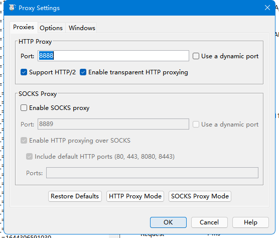
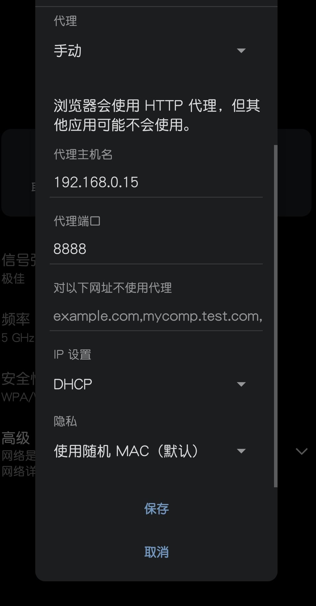

# 使用 Charles 对安卓设备进行 HTTPS 的抓包

最近给老妈搞一个公众号做题的东西，每个月都要做一次，那种比较无聊、纯记忆的题目。

就是考一些行业的法规啊，应急处理应该怎么做这样的。

然后就在电脑微信上进行了 HTTPS 的抓包。

后面有一个钉钉的应用，不能在 PC 上打开，开始构思怎么进行安卓的抓包。

## 铺垫

在 安卓 N - 7.0 版本之后，系统将不再认可用户的证书作为 HTTPS 协议的支持。

也就是说在设置里面，导入 CA 证书，选择证书文件这样的操作流程在 7.0 以上的版本就不能用了。

用户证书不信任没关心，我们可以导入系统证书。

## 系统证书

系统证书储存在 `/etc/security/cacerts` 目录中，需要使用 root 权限才能打开到这个目录。

该目录下都是系统信任的证书，格式类似于 `xxxxx.0` 这样的。

我们导出 Charles 的 pem 格式的证书，使用 openssl:

```bash
openssl  x509 -inform PEM -subject_hash_old -in out.pem
```

输出的第一行是我们要的东西，形如：`4f1de2a3` 这样的。

我们把 pem 文件重命名为：`4f1decb3.0` ，复制到安卓的证书路径中，重启手机就好了。


## Charles

Proxy -> Proxy Settings

> 

## WLAN 设置

连接到 Charles 的代理




现在 Charles 上就可以对 HTTPS 的连接进行解密了。


Enjoy !
