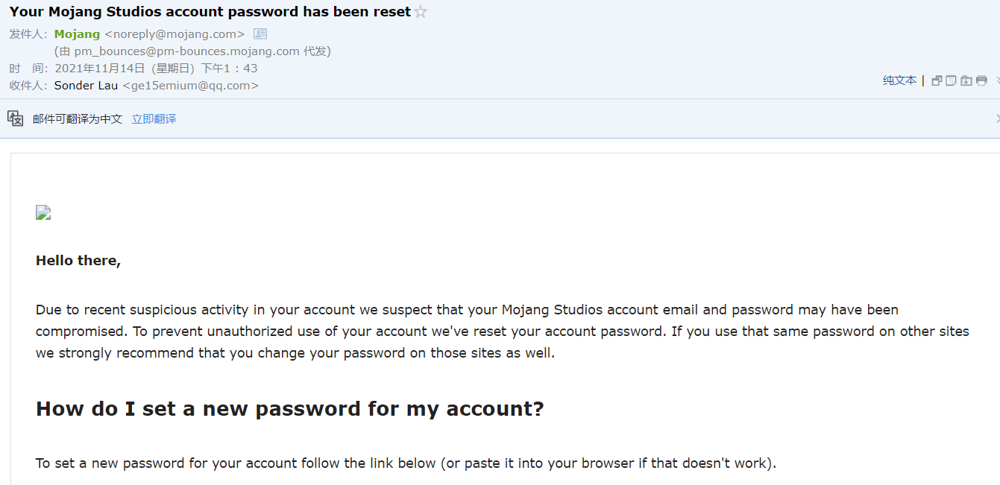

# 数字隐私

起因：

> 

我的 Mojang 账号出现了一些可疑行为，因此官方把我的密码重置了。

我这时候才开始思考，从什么时候开始我的各个平台的账号密码开始变得非常的相似，头像、ID、邮箱使用的都几乎一样，几个密码之间的不同点仅仅是一小部分，而且还与平台名称有关。一旦这些网站出现了数据库被爆，[信息泄露等](https://github.com/ffffffff0x/Dork-Admin)事件，我的很多个平台可能都会陷入危机当中，随时有可能被人破解密码的格式。

我决定现在开始对我的各个平台之间的信息开始做改变。

虽然从理论上讲，我已经将我的弱密码、不同账户之间的关联关系暴露给了互联网，但是只要我现在去改变，多少还是有些作用的。

## 密码管理器

对于密码管理器的检测可以参考：

[Password Manager Hacking](https://www.ise.io/casestudies/password-manager-hacking/)

我在这几个之中选择了 [Kee Pass Manager](https://keepass.info/) 因为开源、免费，于是我选择了这个。

也是因为免费因此没有了网络同步等一些特性，同时界面的话也比较的中规中矩，没有那么现代化的设计。

安全性上不比其他的差多少，同步的问题这里先挖个坑，后续看看自己搭一个 WebDAV 之类的同步。

## 输入法

我早就有想换输入法的冲动了。

国内的输入法大多都有捆绑和其他的一些东西，我一般也就使用自带的微软拼音输入法。

但是微软配音不自带小鹤双拼的方案，每次换电脑都需要手动的输入，麻烦一些。

遂直接换成了 RIME 小狼毫。

借鉴了 [开源配置](https://github.com/qingmail/rime) 自己再简单的修改了一点。

前期的话输入会比较点慢，后面越用越顺手的。

